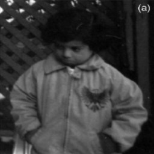
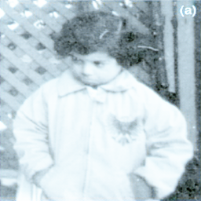
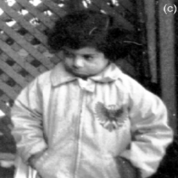
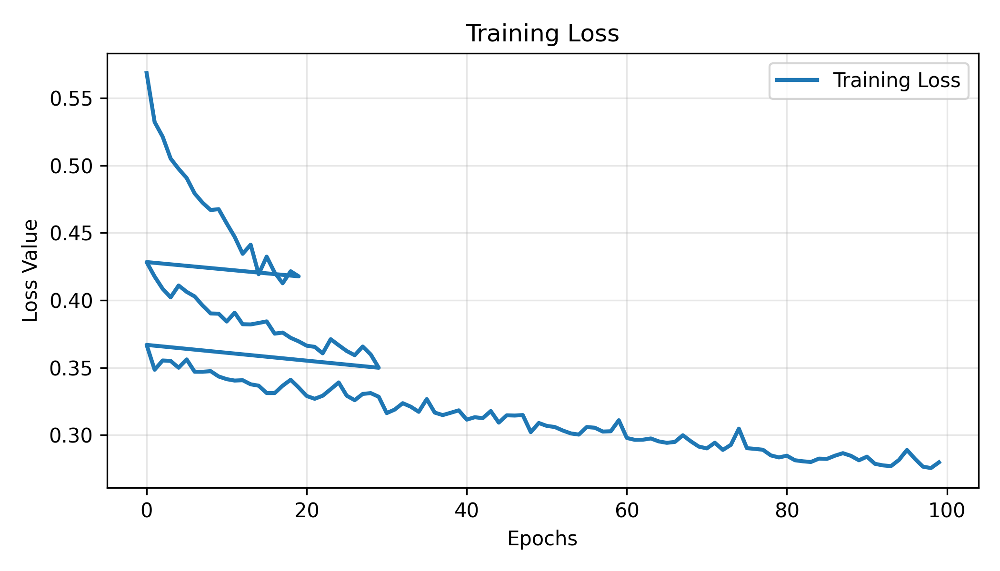

<div align="center">

# 🌙 Low-Light Image Enhancement

**Deep learning–based enhancement of low-light images using a U-Net encoder–decoder with perceptual loss**

[](https://python.org)
[](https://tensorflow.org)
[](LICENSE)

</div>

---

## 🔍 Overview

This project implements a **U-Net–like encoder–decoder architecture** with skip connections for enhancing images captured in low-light conditions. The model learns a mapping from degraded (dark) images to their well-lit counterparts using a combination of reconstruction and perceptual losses.

<div align="center">

| Input (Low-Light) | Enhanced Output | Ground Truth |
|:------------------:|:---------------:|:------------:|
|  |  |  |

</div>

---

## 📁 Project Structure

```
Low-Light-Image-Enhancement/
│
├── notebooks/                          # Jupyter notebooks
│   ├── 01_baseline_training.ipynb      # Original baseline (MSE loss)
│   └── 02_perceptual_training.ipynb    # Improved version (perceptual loss)
│
├── data/                               # Dataset (not tracked — see data/README.md)
│   ├── train/
│   ├── eval/
│   └── test/
│
├── models/                             # Saved model weights (not tracked — see models/README.md)
│
├── results/
│   ├── inference/                      # Model output samples
│   ├── plots/                          # Training metric plots
│   ├── comparisons/                    # Visual model comparisons
│   └── metrics/                        # CSV evaluation logs
│
├── docs/                               # Documentation assets
│   └── training_log_plot.png
│
├── requirements.txt                    # Python dependencies
├── LICENSE                             # MIT License
└── README.md
```

---

## ⚙️ Setup

### 1. Clone the repository

```bash
git clone https://github.com/chiragprajapati1405/Low-Light-Image-Enhancement.git
cd Low-Light-Image-Enhancement
```

### 2. Create a virtual environment

```bash
# Using venv
python3 -m venv .venv
source .venv/bin/activate        # Linux / macOS
# .venv\Scripts\activate         # Windows

# Or using Conda
conda create -n lowlight python=3.10
conda activate lowlight
```

### 3. Install dependencies

```bash
pip install --upgrade pip
pip install -r requirements.txt
```

### 4. Download the dataset

Follow the instructions in [`data/README.md`](data/README.md) to download and organize the dataset.

---

## 🚀 Usage

### Training

Launch Jupyter and open the training notebooks:

```bash
jupyter notebook
```

| Notebook | Description |
|----------|-------------|
| [`01_baseline_training.ipynb`](notebooks/01_baseline_training.ipynb) | Baseline U-Net with MSE reconstruction loss |
| [`02_perceptual_training.ipynb`](notebooks/02_perceptual_training.ipynb) | Enhanced version with VGG perceptual loss + experiments |

### Inference

```python
from tensorflow import keras
from PIL import Image
import numpy as np

# Load model
model = keras.models.load_model("models/best_model_perceptual.keras")

# Load and preprocess image
img = np.array(Image.open("path/to/low_light_image.png")) / 255.0
img = np.expand_dims(img, axis=0)

# Enhance
enhanced = model.predict(img)
```

---

## 🧠 Model Architecture

- **Architecture:** U-Net–like encoder–decoder with skip connections
- **Encoder:** Convolutional layers for hierarchical feature extraction
- **Decoder:** Deconvolution / upsampling layers for image reconstruction
- **Framework:** TensorFlow / Keras

## 📊 Loss Functions

| Component | Description |
|-----------|-------------|
| **Reconstruction Loss** | Mean Squared Error (MSE) between enhanced and ground-truth images |
| **Perceptual Loss** | Feature-space loss using a pretrained VGG network |
| **Balancing Weight** | λ = 1×10⁻² to balance structural vs. perceptual fidelity |

## 📈 Training Configuration

| Parameter | Value |
|-----------|-------|
| Optimizer | Adam |
| Learning Rate | ~1×10⁻⁴ |
| Image Preprocessing | Normalize to [0, 1] |
| Metrics | PSNR, SSIM, MSE |

---

## 📊 Results

### Training Curves

<div align="center">



</div>

### Model Comparison

Multiple experiments were conducted to find the optimal loss configuration:

| Model | Loss Function | Notes |
|-------|--------------|-------|
| Baseline | MSE only | No perceptual component |
| Perceptual | MSE + VGG | Best overall quality |
| λ = 1×10⁻⁴ | MSE + VGG (low λ) | More structural detail |
| Perc + Norm | MSE + VGG + Norm | Stable training |
| Perc + Norm + λ5e⁻⁴ | MSE + VGG + Norm (λ = 5×10⁻⁴) | Balanced |

Detailed metrics are available in [`results/metrics/`](results/metrics/).

---

## 📄 License

This project is licensed under the [MIT License](LICENSE).

---

## 👤 Author

**Chirag Prajapati**

- GitHub: [@chiragprajapati1405](https://github.com/chiragprajapati1405)

---

<div align="center">

⭐ **If you found this project useful, please consider giving it a star!** ⭐

</div>
